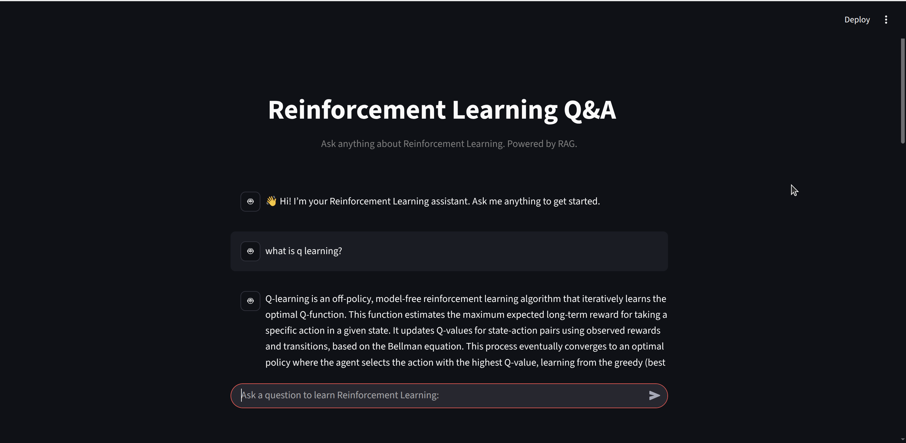

# RAG-based Reinforcement Learning Q&A Assistant
A conversational **Retrieval-Augmented Generation (RAG)** chatbot that acts as an instructor for **Reinforcement Learning**.  
It maintains **conversation memory**, so you can ask follow-up questions naturally.
Built with [LangChain](https://github.com/langchain-ai/langchain), [LangGraph](https://github.com/langchain-ai/langgraph), [HuggingFace embeddings](https://huggingface.co/), [ChromaDB](https://www.trychroma.com/), and [Streamlit](https://streamlit.io/).
Deployed on [Streamlit Cloud](https://rag-reinforcement-learning.streamlit.app/) for interactive use.

---

---
## Table of Contents
- [Features](#introduction)
- [Tech Stack](...)
- [Run Locally](#Installation)
- [Live Demo](...)

---
## Features
- **Question Answering** over Reinforcement Learning Medium blogs and papers.
- **Conversational flow with memory**: context is preserved across turns.
- **Dynamic tool use**: the LLM dynamically decides whether to:
  - Use the **retrieval tool** (searching ChromaDB for relevant documents), or  
  - Answer directly from its own knowledge.
- **RAG pipeline**: retrieve relevant chunks from ChromaDB and generate responses.
- **Streaming UI**: assistant responses stream chunk-by-chunk in a chat interface.
- **Example questions** (e.g., “What is Q-learning?”, “Explain policy gradients”) for quick start.

---
## Tech Stack
- [LangChain](https://github.com/langchain-ai/langchain) – orchestration of LLM and tools.  
- [LangGraph](https://github.com/langchain-ai/langgraph) – state graph for tools, memory, and conversation flow.  
- [HuggingFace Embeddings](https://huggingface.co/sentence-transformers/all-MiniLM-L6-v2) – semantic vector representations.  
- [ChromaDB](https://www.trychroma.com/) – vector database for retrieval.  
- [Google Generative AI (Gemini)](https://ai.google/) – large language model.  
- [Streamlit](https://streamlit.io/) – lightweight chat-based UI.  

---
## Run Locally
### 1. Clone the repo
  ```bash
  git clone https://github.com/parichehrvn/rag-reinforcement-learning.git
  cd rag-reinforcement-learning
  ```

### Prerequisites
- Python 3.12.3
- Required libraries:
  ```bash
  pip install -r requirements.txt
  ```
  
### Set up environment
- Copy the example file:
  ```bash
  cp .env.example .env
  ```
- Add your API key in .env:
  ```bash
  GOOGLE_API_KEY=your_api_key_here
  ```

### Run locally
  ```bash
  cd app
  streamlit run main.py
  ```

## Live Demo
Try it here: [Reinforcement Learning Q&A Assistant](https://rag-reinforcement-learning.streamlit.app/) 🚀
